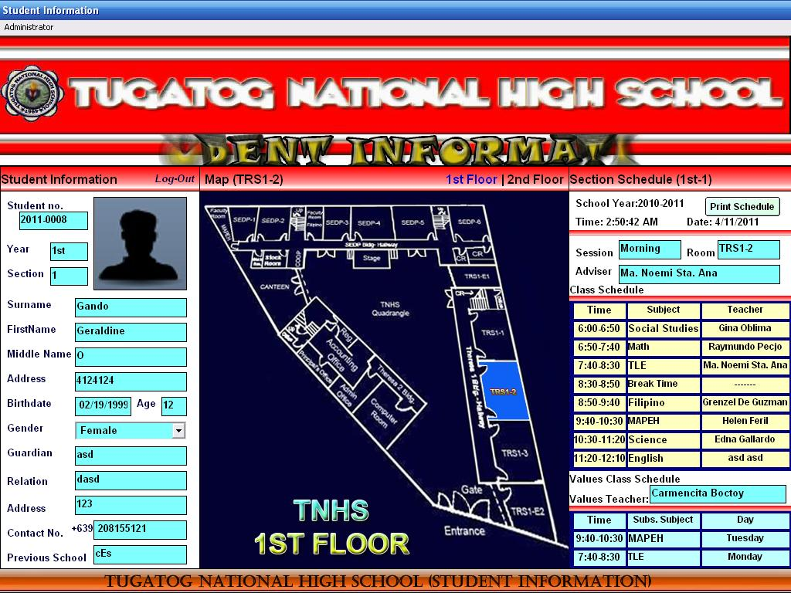



## Enrollment System

### Description

This is a Computerized Enrollment System with Section Scheduling of a Selected School-

Tugatog National High School.

Features include: SMS Application, Webcam application for storing users and students picture, Mapping application for scheduling the section of the students.

if you find bugs, email me at arthur_dagreat05@yahoo.com
 
### More Info
 

             |
---                |---
**Submitted On**   |2011-03-28 03:17:48
**By**             |[John Arthur Vargas](https://github.com/Planet-Source-Code/PSCIndex/blob/master/ByAuthor/john-arthur-vargas.md)
**Level**          |Intermediate
**User Rating**    |5.0 (10 globes from 2 users)
**Compatibility**  |VB 6\.0
**Category**       |[Complete Applications](https://github.com/Planet-Source-Code/PSCIndex/blob/master/ByCategory/complete-applications__1-27.md)
**World**          |[Visual Basic](https://github.com/Planet-Source-Code/PSCIndex/blob/master/ByWorld/visual-basic.md)
**Archive File**   |[Enrollment2201744102011\.zip](https://github.com/Planet-Source-Code/john-arthur-vargas-enrollment-system__1-73851/archive/master.zip)

